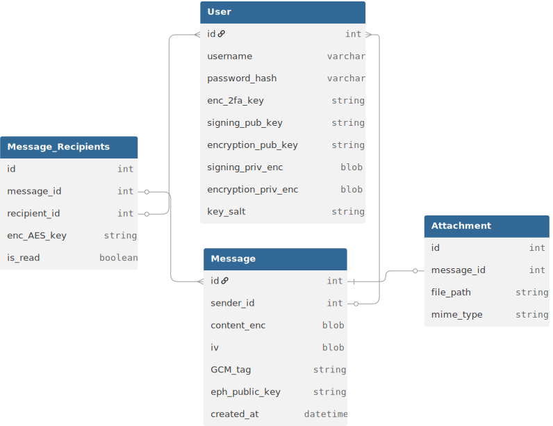

# Specyfikacja projektu systemu wiadomości

### Logowanie
1. Dane wejściowe
  - użytkownik podaje username i password
  - serwer sprawdza ich poprawność
2. 2FA
  - serwer pobiera `enc_2fa_key` z bazy danych
  - Odszyfrowuje go Master Key'em serwera (.env) z użyciem AES-GCM
  - `pyotp` weryfikuje kod (okno czasowe T-1, T, T+1)
  - Po sukcesie serwer generuje `session_id` z httpOnly
3. Klucze
  - serwer przesyła klucze z UserKeys
  - PBKDF2(hasło + salt) -> Master Key
  - przeglądarka odszyfrowuje klucze prywatne (AES-GCM)
  - klucze są przechowywane w pamięci aplikacji (`Context API`)

### Rejestracja
1. Dane wejściowe
  - użytkownik podaje username i password
  - `zxcvbn` sprawdza siłę hasła
  - na serwerze jest sprawdzana unikalność nazwy użytkownika `GET /check-username?name=uname`
2. Klucze
  - W przeglądarce generowane są pary kluczy: Ed25519 (podpis) i X25519 (ECDH)
3. Zabezpieczenie kluczy
  - generacja losowego salt
  - PBKDF2(password + salt) -> master key
  - szyfrowanie kluczy prywatnych AES-GCM -> `[12B IV][Ciphertext][16B Tag]`
4. Użytkownik wysyła dane do serwera, a hasło jest haszowane `argon2id`

### 2FA (TOTP)
- serwer generuje unikalny klucz do 2FA
- użytkownik skanuje (podaje) ten klucz do aplikacji
- użytkownik wpisuje kod wyświetlony w aplikacji (aby upewnić się że działa)
- serwer potwierdza działanie kodu
- serwer szyfruje klucz 2FA algorytmem AES-GCM używając master keya z serwera i go zapisuje w tabeli użytkownika
- użytkownik kończy proces rejestracji


## Wysłanie wiadomości
1. Przygotowanie załącznika:
  - generacja `K_att` (AES)
  - szyfrowanie pliku: `enc_file = [IV][ciphertext][tag]`
2. Treść:
  - przygotowanie struktury: `{ "text": "...", "att_key": "base64", "filename": "..."}
  - podpisanie struktury (ed25519 + SHA-512) i dołączenie pola `signature`
3. Szyfrowanie:
  - generacja `K_msg` (AES)
  - szyfrowanie JSON'a: `content_enc = [IV][ciphertext][tag]`
4. Wymiana klucza (ECDH):
  - pobranie klucza publicznego odbiorcy ($B_{pub}$)
  - wygenerowanie tymczasowej pary $(e, E)$
  - obliczenie Shared Secret $S = ECDH(e, B_{pub})$ i $K_{wrap} = HKDF(S)$
  - zaszyfrowanie klucza: `enc_K_msg = [IV][K_msg_encrypted][tag]`

## Odbiór
1. Odzyskanie K_msg:
  - $S = ECDH(b_{priv}, E)$
  - $K_{wrap} = HKDF(S)$
  - Odszyfrowanie `enc_K_msg` (+ weryfikacja tagu)
2. Odszyfrowanie treści
  - `K_msg` + `content_enc`
3. Weryfikacja:
  - sprawdzenie podpisu ed25519 nadawcy w JSON'ie
4. Załącznik:
  - odszyfrowanie pliku przy użyciu `K_att` z JSON'a

## Tech
- Backend - FastAPI
  - cryptography: Ed25519, X25519 (ECDH), AES-GCM, HKDF
  - pyotp: 2FA (TOTP)
  - passlib[argon2]: Argon2id do haseł
  - slowapi: rate limiting do logowania
- Frontend - React
  - Web Crypto API: AES-GCM, HKDF, PBKDF2
  - noble-curves: ed25519, x25519
  - qrcode.react: do kodu QR podczas konfiguracji 2FA
  - zxcvbn: sprawdzenie siły hasła

## Algorytmy
- Argon2id: hashowanie haseł do db
- Ed25519 (EdDSA): podpisywanie treści wiadomości
- X25519 (ECDH): wygenerowanie shared key
- HKDF: wygładzenie shared key
- AES-256-GCM: szyfrowanie i deszyfrowanie wiadomości oraz kluczy 2FA
- TOTP: weryfikacja kodów 6-cyfrowych podczas 2FA
- SHA-512: tworzenie podpisu
- PBKDF2-HMAC-SHA256: generowanie klucza deszyfrującego klucze prywatne z hasła (600,000 iteracji)

# Baza danych
[Link](https://dbdiagram.io/d/693eb807e877c63074c38186)

```DBML
Table User {
  id int [pk]
  username varchar [unique]
  password_hash varchar
  //2FA
  enc_2fa_key string
}

Table UserKeys {
  id int [pk]
  user_id int [ref: - User.id]

  //public keys
  signing_pub_key string //Ed25519 - EdDSA
  encryption_pub_key string //Curve25519 - ECDH
  //private keys (zaszyfrowane hasłem)
  signing_priv_enc blob
  encryption_priv_enc blob

  key_salt string //salt do PBKDF2 przy szyfrowaniu/odszyfrowaniu kluczy
}

Table Message {
  id int [pk]
  sender_id int [ref: > User.id]
  //Treść
  content_enc blob // + tag + iv
  //Ephemeral key nadawcy do ECDH (unikalny do wiadomości)
  eph_public_key string
  created_at datetime
}

Table Message_Recipients {
  id int [pk]
  message_id int [ref: > Message.id]
  recipient_id int [ref: > User.id]
  // klucz AES wiadomości, zaszyfrowany HKDF(ECDH) do konkretnego odbiorcy
  enc_AES_key string
  is_read boolean
}

Table Attachment {
  id int [pk]
  message_id int [ref: > Message.id]
  file_path string
  mime_type string
}

```

